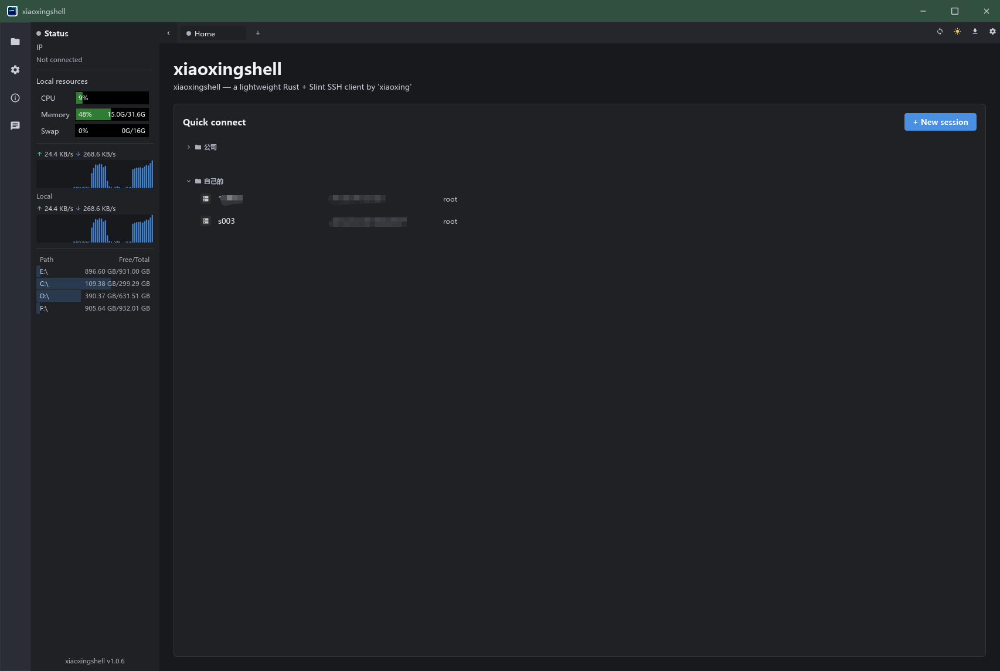
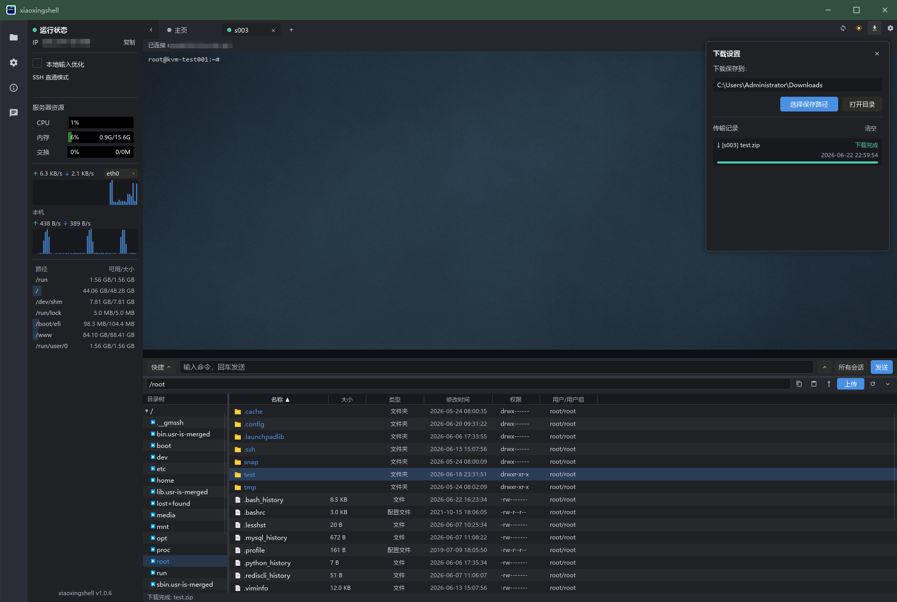

# xiaoxingshell

[简体中文](./README.md) | **English**

A lightweight SSH / terminal client inspired by FinalShell, built entirely with
**Rust + [Slint](https://slint.dev)**.

The goal is to keep the core FinalShell-style experience such as resource
monitoring, session management, and multi-tab terminals, while reducing memory
usage from a 400 MB+ JVM app down to a native app that typically uses only a
few dozen megabytes.

## Screenshots

<p align="center">
  <br>
  <em>Welcome page: session management + local resource monitoring</em>
</p>

<p align="center">
  <br>
  <em>Multi-tab terminal (including fullscreen btop rendering) + bottom SFTP browser + remote resource monitoring</em>
</p>

## Download and Installation

Whenever a `v*` tag is pushed, GitHub Actions automatically builds binaries for
**Windows / Linux / macOS** and publishes them to the
[Releases](https://github.com/xiaoxinghaha/xiaoxingshell/releases) page.

### Windows

Download `xiaoxingshell-*-windows-x86_64.zip`, extract it, and run
`xiaoxingshell.exe`.

### Linux

```bash
tar -xzf xiaoxingshell-*-linux-x86_64.tar.gz
cd xiaoxingshell-*-linux-x86_64
./xiaoxingshell

# Optional: install desktop icon + launcher entry
chmod +x install-linux.sh && ./install-linux.sh
```

> Requires glibc >= 2.35 (Ubuntu 22.04+ / Debian 12+). On Wayland, after
> installing the launcher icon, you may need to log out and log back in once.

### macOS

```bash
tar -xzf xiaoxingshell-*-macos-*.tar.gz
# aarch64 = Apple Silicon, x86_64 = Intel

xattr -dr com.apple.quarantine xiaoxingshell
./xiaoxingshell
```

> For building from source, see [Run](#run) below.

## Features

### Implemented

- [x] FinalShell-style UI with dark mode, light mode, and system theme support
- [x] Local input optimization for better usability on high-latency servers
- [x] Double-click to select a word, triple-click to select a line,
      `Ctrl+C` to copy, and `Ctrl+V` to paste
- [x] Local + remote resource monitoring
      (CPU / memory / swap / network / disks)
- [x] Full VT/ANSI terminal emulation
      (`btop`, `htop`, `vim`, and other fullscreen apps render correctly)
- [x] Multi-tab interface
      (welcome page + multiple session tabs)
- [x] Session management:
      create / edit / delete / group / local JSON persistence / export / import
  - Config location:
    `%APPDATA%/xiaoxingshell/sessions.json` on Windows,
    `~/.config/xiaoxingshell/sessions.json` on Linux,
    `~/Library/Application Support/xiaoxingshell/sessions.json` on macOS
- [x] SSH via pure Rust `russh`
      (password / private key / encrypted private key with passphrase)
- [x] SFTP file browsing + upload / download (including drag-and-drop)
      + in-terminal ZMODEM receive (`sz`)
- [x] Double-click a file to edit it, then auto-upload and overwrite the remote
      file after saving, with upload time feedback
- [x] SSH port forwarding / tunnels:
      local `-L`, remote `-R`, dynamic `-D` (SOCKS5)
- [x] Quick commands + command input box
      (including broadcast to all sessions) + command history
- [x] Serial and Telnet sessions
- [x] Outbound proxy support (SOCKS5 / HTTP)
- [x] Encrypted session password storage (ChaCha20-Poly1305)
- [x] Click the eye icon to reveal saved session passwords
- [x] Left-side session manager panel for opening saved sessions quickly
- [x] Remember window size, position, and maximized state between launches

## Tech Stack

| Module        | Choice                                                                 |
| ------------- | ---------------------------------------------------------------------- |
| UI            | [Slint](https://slint.dev) (native Rust UI, no GC)                     |
| Async runtime | [`tokio`](https://tokio.rs)                                            |
| SSH protocol  | [`russh`](https://crates.io/crates/russh) (no libssh dependency)       |
| System stats  | [`sysinfo`](https://crates.io/crates/sysinfo)                          |
| Serialization | `serde` + `serde_json`                                                 |
| Logging       | `tracing` + `tracing-subscriber`                                       |

## Run

```bash
cargo run --release
```

On first launch, the app creates an empty session store at:

- Windows: `%APPDATA%/xiaoxingshell/sessions.json`
- Linux: `~/.config/xiaoxingshell/sessions.json`
- macOS: `~/Library/Application Support/xiaoxingshell/sessions.json`

Then click **"+ New session"** in the top-right area of the welcome page to add
your first server.

## Project Layout

```text
xiaoxingshell/
├── Cargo.toml
├── build.rs                 # Slint build entry
├── ui/
│   ├── app.slint            # Top-level window
│   ├── theme.slint          # Design tokens
│   ├── widgets.slint        # Reusable buttons / inputs / sparkline
│   ├── sidebar.slint        # Left resource monitoring panel
│   ├── tabs.slint           # Top tab bar
│   ├── welcome.slint        # Welcome page / quick connect
│   ├── session_dialog.slint # New / edit session dialog
│   └── terminal_view.slint  # Terminal view
└── src/
    ├── main.rs
    ├── app.rs               # UI ↔ backend bridge
    ├── config.rs            # Session JSON persistence
    ├── system.rs            # CPU / memory / network sampling
    └── ssh.rs               # SSH session worker
```

## Development Notes

- Slint layout DSL is strict. After changing a `.slint` file, `cargo check` is
  usually the fastest feedback loop.
- The application event loop is single-threaded
  (required by Slint). All cross-thread UI updates go through
  `slint::invoke_from_event_loop`.
- The current `check_server_key` behavior accepts any server key
  (similar to `StrictHostKeyChecking=no`). Before production use, proper
  `known_hosts` verification should be added.

## License

MIT OR Apache-2.0 (dual licensed).
